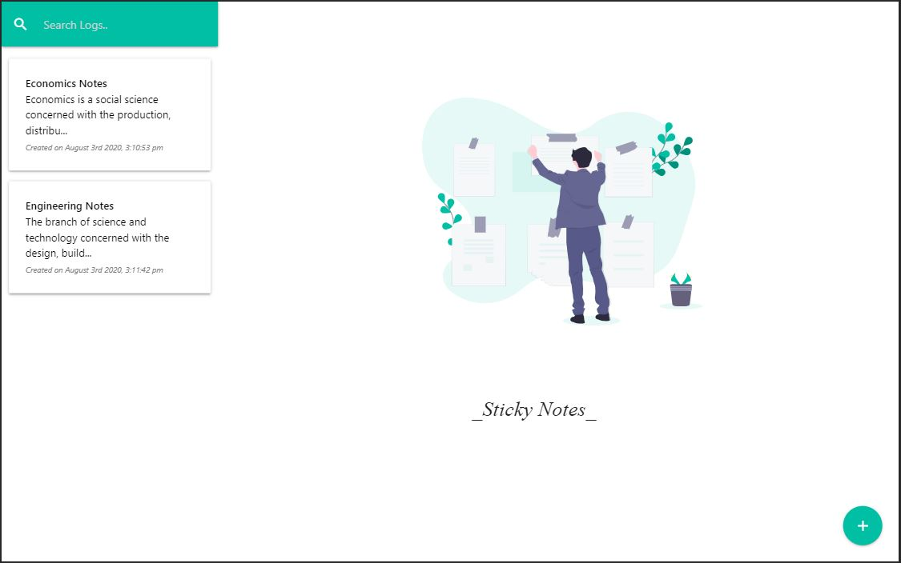
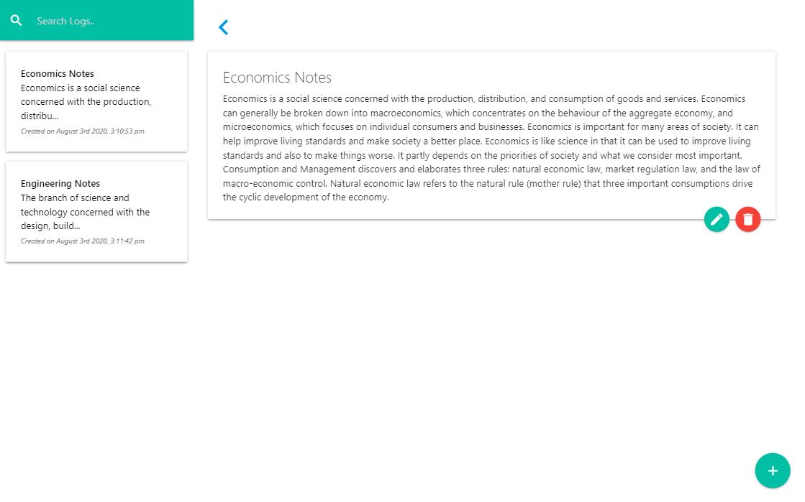
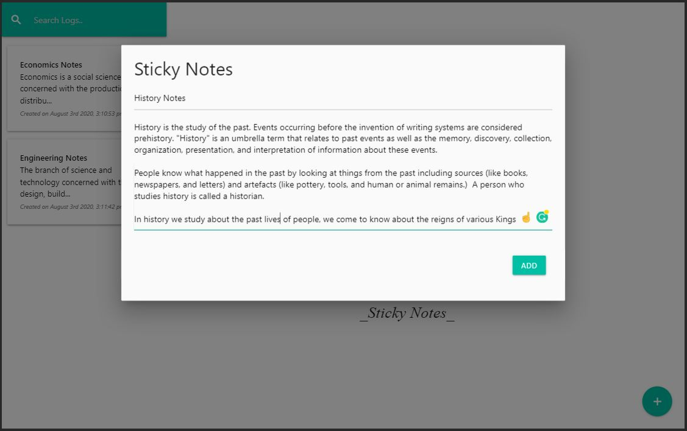

## Sticky Notes

React app to take Sticky Notes. Uses JSON-Server as a mock backend.

To Initialize the Project Follow the following commands

In the project directory, you can run:

### `npm install`

### `npm run dev`

It uses concurrently library to kickStart json-server and React

json-server running on port 5000
ReactJs running on port 3000

Runs the app with the backend JSON-Server
Open http://localhost:3000 Server http://localhost:5000 db.json contains data

### `npm run build`

Builds the app for production to the build folder.

## UI

